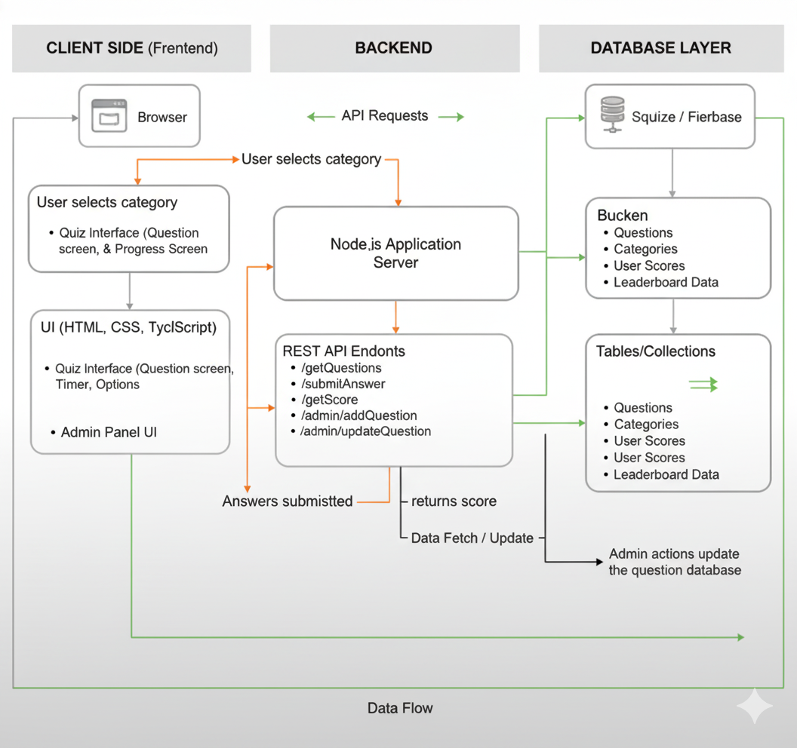
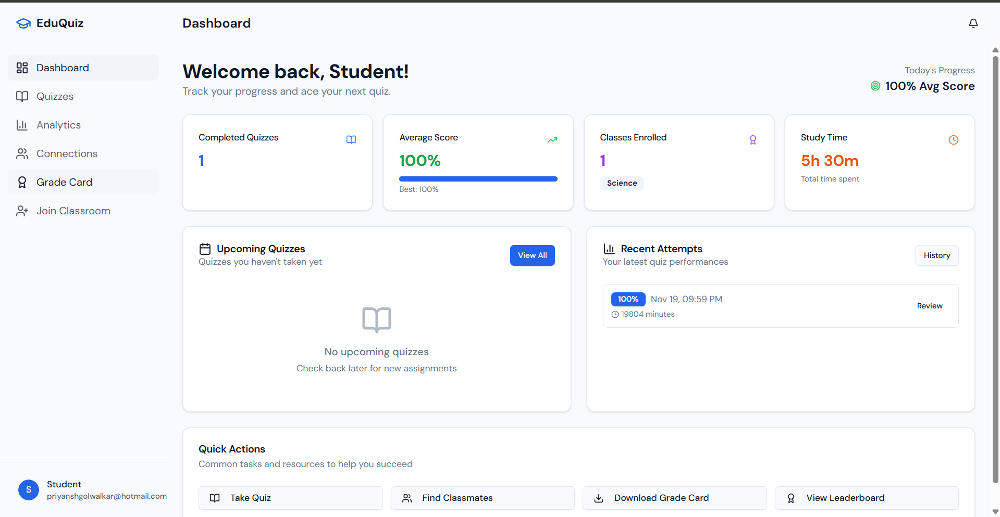
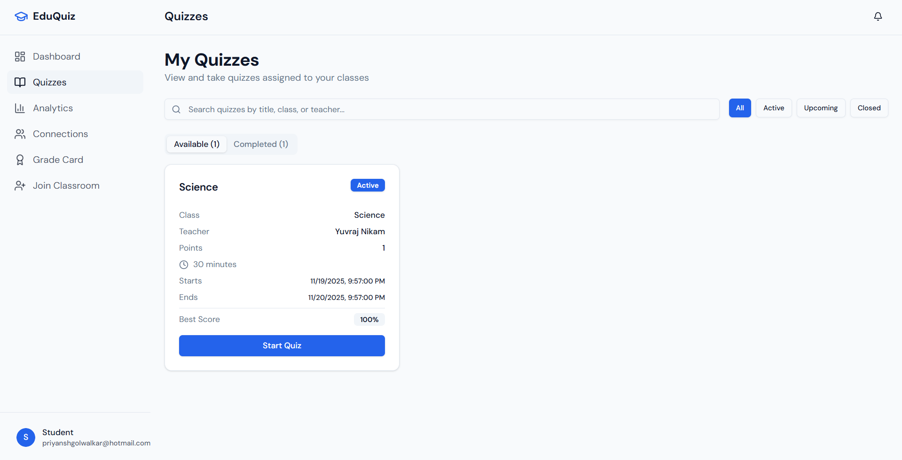

# 🎓 **EduQuiz — Smart Gamified Learning Platform**

An interactive, modern quiz platform built with a full-stack architecture to make learning engaging, measurable, and fun.
EduQuiz helps students take quizzes, view analytics, download grade cards, and track progress — while admins can manage question banks effortlessly.

---

# 🧩 **Project Overview**

EduQuiz bridges the gap between traditional study methods and modern gamified learning.
It provides:

* Clean and responsive UI
* Timed quizzes
* Instant scoring
* Analytics dashboard
* Leaderboard
* Grade card with PDF download
* Admin question management

---

# 🛠 **Tech Stack (Used in This Project)**

### **Frontend**

* React
* TypeScript
* Vite
* Tailwind CSS
* Shadcn/UI Components
* React Router
* PostCSS
* ESLint
* Stylelint
* Custom CSS Variable Detection Script

### **Backend**

* Node.js
* Express.js
* SQLite database (via custom db.js)
* dotenv
* REST API architecture

### **Tools**

* VS Code
* Git & GitHub
* npm
* Vite Dev Server
* Node Server (backend/index.js)

---

# 🏛 **System Architecture**



*(Place your architecture image in the root as `architecture.png`.)*

### **How It Works**

* The **frontend** renders UI, manages quiz flow, and interacts with backend via API calls.
* The **backend** contains Express routes (`routes/`) that fetch and submit quiz data.
* The **database** (`db.js`) manages questions, categories, users, and leaderboard records.
* Admin actions modify question data directly through authenticated routes.

---

# 📁 **Project Structure**

```
QUIZ_WEB/
│
├── backend/
│   ├── routes/
│   ├── data.js
│   ├── db.js
│   ├── index.js
│   └── .env
│
├── public/
├── server/
├── src/          # React frontend source
│
├── .env
├── index.html
├── tailwind.config.cjs
├── vite.config.ts
├── components.json
├── tsconfig.json
├── tsconfig.app.json
├── tsconfig.node.json
├── package.json
└── README.md
```

---

# 📸 **UI Screenshots**

### **Dashboard**



### **Quizzes Page**



### **Grade Card**


---

# ✨ **Core Features**

### 🌟 Student Features

* Quiz categories (Science, Math, History, etc.)
* Timed quiz sessions
* Instant score calculation
* Explanation for incorrect answers
* Attempts history
* Analytics:

  * Study time
  * Accuracy
  * Best score
* Grade card with **PDF download**
* Leaderboard
* Clean responsive UI

### 🔐 Admin Features

* Add new questions
* Edit questions
* Delete questions
* Manage categories
* Update difficulty levels

---

# 🚀 **Setup & Run Instructions**

## 1️⃣ **Clone the Repository**

```bash
git clone <your-repo-url>
cd QUIZ_WEB
```

---

# 🖥 **Frontend Setup (React + Vite)**

### Install dependencies

```bash
npm install
```

### Start dev server

```bash
npm run dev
```

---

# 🔌 **Backend Setup (Node + Express)**

Navigate to backend folder:

```bash
cd backend
npm install
```

### Start backend server

```bash
npm run start
```

Your API will run at:

```
http://localhost:3001
```

---

# 🔐 **.env.example**

Create `.env` files in root and backend folders.

### **Frontend `.env.example`**

```
VITE_API_URL=http://localhost:3001
```

### **Backend `.env.example`**

```
PORT=3001
DB_PATH=./quiz.db
```

---

# 🔌 **API Endpoints**

### **Public APIs**

| Method | Endpoint                  | Description                    |
| ------ | ------------------------- | ------------------------------ |
| GET    | `/getQuestions/:category` | Fetch quiz questions           |
| POST   | `/submitAnswer`           | Submit answers & compute score |
| GET    | `/getScore/:userId`       | Fetch user score               |
| GET    | `/leaderboard`            | Leaderboard data               |

### **Admin APIs**

| Method | Endpoint                    | Action             |
| ------ | --------------------------- | ------------------ |
| POST   | `/admin/addQuestion`        | Add a new question |
| PUT    | `/admin/updateQuestion/:id` | Update question    |
| DELETE | `/admin/deleteQuestion/:id` | Delete question    |

---

# 🗃 **Database Schema (SQLite)**

### **Questions**

```
id
question_text
option_a
option_b
option_c
option_d
correct_option
category
difficulty
explanation
```

### **Scores**

```
id
user
score
total_questions
time_taken
timestamp
```

### **Leaderboard**

```
id
username
best_score
avg_score
attempts
```

---

# 📊 **Impact & Metrics**

From initial testing:

* Users found the interface clean and more engaging than textbooks
* Quiz-timer improved focus and accuracy
* Analytics dashboard increased self-tracking
* Database operations were fast even on low hardware
* No lag in question loading due to lightweight architecture

---

# 🚧 **What’s Next**

Planned Improvements:

* AI-recommended questions
* Multiplayer quiz battle
* Push notifications
* Bookmark difficult questions
* Full mobile app (React Native)
* Teacher view with class reports
* Dark mode

---

# 🏁 **Conclusion**

EduQuiz delivers a smooth, gamified learning experience with a modern UI and scalable architecture.
It is simple for students, efficient for admins, and easy to extend with new features.
